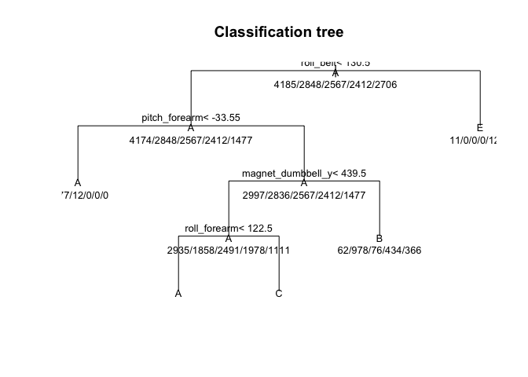

# Machine Learning Project
Christian Romo  
18/02/2018  


# Overview

One thing that people regularly do is quantify how much of a particular activity they do, but they rarely quantify how well they do it.

The goal of this project is to predict the manner in which people perform certain weight lifting exercises using data from accelerometers on belt, forearm, arm, and dumbell of 6 participants.

# Analysis

First we read the training and testing data.

```r
    set.seed(89675)
    train <- read.csv(file = "https://d396qusza40orc.cloudfront.net/predmachlearn/pml-training.csv")
    test <- read.csv(file = "https://d396qusza40orc.cloudfront.net/predmachlearn/pml-testing.csv")
```

The codebook indicates that the data set includes summary statistics so we drop these columns in favor of using just raw sensor data.


Creating the training and testing data partitions.

```r
    partition <- createDataPartition(y = train$classe, p = 0.75, list = FALSE)
    trainData <- train[partition, ]
    testData <- train[-partition, ]
```

Data exploration to find out columns with no variability in them.

```r
    metrics <- nearZeroVar(trainData, saveMetrics = TRUE)
    metrics
```

```
##                      freqRatio percentUnique zeroVar   nzv
## roll_belt             1.088757    7.75920641   FALSE FALSE
## pitch_belt            1.040000   11.61163202   FALSE FALSE
## yaw_belt              1.022959   12.39298818   FALSE FALSE
## total_accel_belt      1.058071    0.19703764   FALSE FALSE
## gyros_belt_x          1.049164    0.89006659   FALSE FALSE
## gyros_belt_y          1.126964    0.46201930   FALSE FALSE
## gyros_belt_z          1.053852    1.11428183   FALSE FALSE
## accel_belt_x          1.046901    1.08030982   FALSE FALSE
## accel_belt_y          1.119194    0.95121620   FALSE FALSE
## accel_belt_z          1.037707    1.98396521   FALSE FALSE
## magnet_belt_x         1.142322    2.11985324   FALSE FALSE
## magnet_belt_y         1.134199    1.97037641   FALSE FALSE
## magnet_belt_z         1.011299    3.01671423   FALSE FALSE
## roll_arm             50.000000   16.65307786   FALSE FALSE
## pitch_arm            77.272727   19.30968882   FALSE FALSE
## yaw_arm              32.692308   18.23617339   FALSE FALSE
## total_accel_arm       1.008837    0.44163609   FALSE FALSE
## gyros_arm_x           1.007732    4.30085609   FALSE FALSE
## gyros_arm_y           1.420513    2.50713412   FALSE FALSE
## gyros_arm_z           1.110540    1.58988993   FALSE FALSE
## accel_arm_x           1.064516    5.19771708   FALSE FALSE
## accel_arm_y           1.208861    3.55347194   FALSE FALSE
## accel_arm_z           1.115789    5.21810029   FALSE FALSE
## magnet_arm_x          1.014706    9.00258187   FALSE FALSE
## magnet_arm_y          1.161290    5.79562441   FALSE FALSE
## magnet_arm_z          1.061728    8.49979617   FALSE FALSE
## roll_dumbbell         1.050000   86.27530915   FALSE FALSE
## pitch_dumbbell        2.330000   84.13507270   FALSE FALSE
## yaw_dumbbell          1.075269   85.67740182   FALSE FALSE
## total_accel_dumbbell  1.047527    0.29215926   FALSE FALSE
## gyros_dumbbell_x      1.029018    1.60347873   FALSE FALSE
## gyros_dumbbell_y      1.370546    1.84807718   FALSE FALSE
## gyros_dumbbell_z      1.019651    1.35888028   FALSE FALSE
## accel_dumbbell_x      1.004049    2.79249898   FALSE FALSE
## accel_dumbbell_y      1.016393    3.09145264   FALSE FALSE
## accel_dumbbell_z      1.168675    2.74493817   FALSE FALSE
## magnet_dumbbell_x     1.128788    7.33795353   FALSE FALSE
## magnet_dumbbell_y     1.200000    5.63255877   FALSE FALSE
## magnet_dumbbell_z     1.148148    4.50468814   FALSE FALSE
## roll_forearm         11.804878   13.20152195   FALSE FALSE
## pitch_forearm        58.060000   18.10028536   FALSE FALSE
## yaw_forearm          14.730964   12.29107216   FALSE FALSE
## total_accel_forearm   1.108280    0.47560810   FALSE FALSE
## gyros_forearm_x       1.044271    1.94999321   FALSE FALSE
## gyros_forearm_y       1.035336    4.91914662   FALSE FALSE
## gyros_forearm_z       1.143662    2.00434842   FALSE FALSE
## accel_forearm_x       1.166667    5.36757712   FALSE FALSE
## accel_forearm_y       1.026667    6.69248539   FALSE FALSE
## accel_forearm_z       1.032258    3.84563120   FALSE FALSE
## magnet_forearm_x      1.101695    9.91982606   FALSE FALSE
## magnet_forearm_y      1.223881   12.52208180   FALSE FALSE
## magnet_forearm_z      1.045455   11.04090230   FALSE FALSE
## classe                1.469452    0.03397201   FALSE FALSE
```
We can see that all the columns have variability so we preserve all of them for the analysis.


Firts atempts of creating a prediction model were taking too long to construct, especially for
Regression Trees and Random Forest, so I had to enable parallel processing to get a better 
performance and reduce processing time.

```r
    cluster <- makeCluster(detectCores() - 1)
    registerDoParallel(cluster)
```

Also I needed to control the execution of the training methods to improve performance and
add resampling and cross-validation features to the selected traning functions.

```r
    fitControl <- trainControl(method = "cv", number = 5, allowParallel = TRUE)
```

We area trying to predict the 'classe' variable of the data set, this is a factor variable with 5
levels indicating how well was the lifting exercise executed. If we try a linear regression model
we'll get an error because of the nature of the data we are trying to predict.


First we try to fit a model with Regression Trees, which is a better method for classification problems
and data divided into groups, also offering a better perfomance in non linear settings.

```r
    # regression trees
    modelTree <- train(classe ~ . , method="rpart", data = trainData, trControl = fitControl)
    print(modelTree$finalModel)
```

```
## n= 14718 
## 
## node), split, n, loss, yval, (yprob)
##       * denotes terminal node
## 
##  1) root 14718 10533 A (0.28 0.19 0.17 0.16 0.18)  
##    2) roll_belt< 130.5 13478  9304 A (0.31 0.21 0.19 0.18 0.11)  
##      4) pitch_forearm< -33.55 1189    12 A (0.99 0.01 0 0 0) *
##      5) pitch_forearm>=-33.55 12289  9292 A (0.24 0.23 0.21 0.2 0.12)  
##       10) magnet_dumbbell_y< 439.5 10373  7438 A (0.28 0.18 0.24 0.19 0.11)  
##         20) roll_forearm< 122.5 6445  3810 A (0.41 0.18 0.18 0.17 0.062) *
##         21) roll_forearm>=122.5 3928  2621 C (0.076 0.18 0.33 0.23 0.18) *
##       11) magnet_dumbbell_y>=439.5 1916   938 B (0.032 0.51 0.04 0.23 0.19) *
##    3) roll_belt>=130.5 1240    11 E (0.0089 0 0 0 0.99) *
```

If we print the tree we can see that we are missing the classification for the 'D' class.

```r
    plot(modelTree$finalModel, uniform = TRUE, main = "Classification tree")
    text(modelTree$finalModel, use.n = TRUE, all = TRUE, cex = 0.8)
```

<!-- -->

Finally if we print the confusion matrix we see that the accuracy is too low and the model is 
failling to classificate the 'D' class.

```r
    confusionMatrix(testData$classe, predict(modelTree, testData))
```

```
## Confusion Matrix and Statistics
## 
##           Reference
## Prediction    A    B    C    D    E
##          A 1266   19  107    0    3
##          B  406  308  235    0    0
##          C  402   32  421    0    0
##          D  362  134  308    0    0
##          E  125  120  254    0  402
## 
## Overall Statistics
##                                           
##                Accuracy : 0.4888          
##                  95% CI : (0.4747, 0.5029)
##     No Information Rate : 0.5222          
##     P-Value [Acc > NIR] : 1               
##                                           
##                   Kappa : 0.3317          
##  Mcnemar's Test P-Value : NA              
## 
## Statistics by Class:
## 
##                      Class: A Class: B Class: C Class: D Class: E
## Sensitivity            0.4943  0.50245  0.31774       NA  0.99259
## Specificity            0.9449  0.85062  0.87874   0.8361  0.88909
## Pos Pred Value         0.9075  0.32455  0.49240       NA  0.44617
## Neg Pred Value         0.6309  0.92288  0.77673       NA  0.99925
## Prevalence             0.5222  0.12500  0.27019   0.0000  0.08259
## Detection Rate         0.2582  0.06281  0.08585   0.0000  0.08197
## Detection Prevalence   0.2845  0.19352  0.17435   0.1639  0.18373
## Balanced Accuracy      0.7196  0.67653  0.59824       NA  0.94084
```

Next we try to fit a model with Boosting, which is a better method for classification problems
and data divided into groups, also offering a better perfomance in non linear settings.

```r
    # boosting
    modelBoos <- train(classe ~ . , method="gbm", data = trainData, trControl = fitControl, verbose = FALSE)
```

Print of the final model with Boosting method.

```r
    print(modelBoos$finalModel)
```

```
## A gradient boosted model with multinomial loss function.
## 150 iterations were performed.
## There were 52 predictors of which 44 had non-zero influence.
```

Now a print of the confusion matrix for the boosting model.

```r
    confusionMatrix(testData$classe, predict(modelBoos, testData))
```

```
## Confusion Matrix and Statistics
## 
##           Reference
## Prediction    A    B    C    D    E
##          A 1373    9    8    5    0
##          B   34  891   22    1    1
##          C    0   23  821    9    2
##          D    0    2   34  765    3
##          E    0    9    7   18  867
## 
## Overall Statistics
##                                           
##                Accuracy : 0.9619          
##                  95% CI : (0.9561, 0.9671)
##     No Information Rate : 0.2869          
##     P-Value [Acc > NIR] : < 2.2e-16       
##                                           
##                   Kappa : 0.9518          
##  Mcnemar's Test P-Value : NA              
## 
## Statistics by Class:
## 
##                      Class: A Class: B Class: C Class: D Class: E
## Sensitivity            0.9758   0.9540   0.9204   0.9586   0.9931
## Specificity            0.9937   0.9854   0.9915   0.9905   0.9916
## Pos Pred Value         0.9842   0.9389   0.9602   0.9515   0.9623
## Neg Pred Value         0.9903   0.9891   0.9825   0.9920   0.9985
## Prevalence             0.2869   0.1905   0.1819   0.1627   0.1780
## Detection Rate         0.2800   0.1817   0.1674   0.1560   0.1768
## Detection Prevalence   0.2845   0.1935   0.1743   0.1639   0.1837
## Balanced Accuracy      0.9848   0.9697   0.9560   0.9746   0.9923
```
This time we get better accuracy than Regression Trees and we were are able to correctly
classificate the 'D' class. Even with more than 90% accuracy we may not be able to get a good performance on
the testing set, so let's try another model.

Next we try to fit a model with Random Forest, which offer better accuracy with the downside of larger
processing times, but we took advantage of R's parallel processing.

```r
    # random forest
    modelRFor <- train(classe ~ . , method="rf", data = trainData, trControl = fitControl)
```

Let's look at the summary of the final model.

```r
    print(modelRFor$finalModel)
```

```
## 
## Call:
##  randomForest(x = x, y = y, mtry = param$mtry) 
##                Type of random forest: classification
##                      Number of trees: 500
## No. of variables tried at each split: 27
## 
##         OOB estimate of  error rate: 0.65%
## Confusion matrix:
##      A    B    C    D    E class.error
## A 4180    4    0    0    1 0.001194743
## B   21 2819    8    0    0 0.010182584
## C    0   11 2549    7    0 0.007012076
## D    0    1   26 2383    2 0.012023217
## E    0    1    3   11 2691 0.005543237
```

And finally the confusion matrix to see if we get better accuracy.

```r
    confusionMatrix(testData$classe, predict(modelRFor, testData))
```

```
## Confusion Matrix and Statistics
## 
##           Reference
## Prediction    A    B    C    D    E
##          A 1394    0    1    0    0
##          B    8  939    1    1    0
##          C    0    1  853    1    0
##          D    0    0   10  793    1
##          E    0    0    1    2  898
## 
## Overall Statistics
##                                          
##                Accuracy : 0.9945         
##                  95% CI : (0.992, 0.9964)
##     No Information Rate : 0.2859         
##     P-Value [Acc > NIR] : < 2.2e-16      
##                                          
##                   Kappa : 0.993          
##  Mcnemar's Test P-Value : NA             
## 
## Statistics by Class:
## 
##                      Class: A Class: B Class: C Class: D Class: E
## Sensitivity            0.9943   0.9989   0.9850   0.9950   0.9989
## Specificity            0.9997   0.9975   0.9995   0.9973   0.9993
## Pos Pred Value         0.9993   0.9895   0.9977   0.9863   0.9967
## Neg Pred Value         0.9977   0.9997   0.9968   0.9990   0.9998
## Prevalence             0.2859   0.1917   0.1766   0.1625   0.1833
## Detection Rate         0.2843   0.1915   0.1739   0.1617   0.1831
## Detection Prevalence   0.2845   0.1935   0.1743   0.1639   0.1837
## Balanced Accuracy      0.9970   0.9982   0.9922   0.9962   0.9991
```

# Results

Random Forest is giving better accuracy than previous models and with the use of parallel processing
the processing time is just a few minutes. Let's try the model with the testing data.

```r
    predictedValues <- predict(modelRFor, test)
    predictedValues
```

```
##  [1] B A B A A E D B A A B C B A E E A B B B
## Levels: A B C D E
```
We can see the predicted values for the 20 test cases and if we validate this with the quiz results
it's a 20 out of 20 score.

After trying some predictions models we got accuracy rates above 90% with boosting and random forest.
An improvement for this model could be to combine prediction models, in this case the ones with better
accuracy rates, to see if we can get better results and lower error rates.
   


